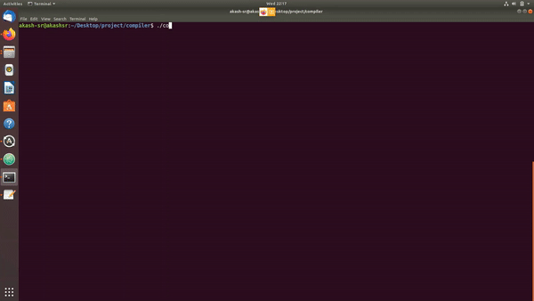

# Compiler

This repository contains the compiler implementation for a custom language as a part of course work for CS F363 - Compiler Construction at BITS Pilani under instructor [Vandana Agarwal](https://universe.bits-pilani.ac.in/pilani/vandana/profile).

The language is strongly type and supports features such as:

- Static scoping of variables.

- Assignment, I/O, Declarative, Iterative, Conditional, Function call statements.

- Arithmetic and Boolean expressions.

- Dynamic type checking.

  The language specifications can be found [here](https://github.com/akash-sr/compiler/blob/main/LanguageSpecifications.pdf)
  
<p align = "center">
	
</p>

----

### Table of Contents

- [How to run](#how-to-run)
- [Demo](#demo)

----

### How to run

- Clone the repository and enter ``` cd compiler ```
- Compile the code using ``` make ```
- Run the compiler using ``` ./compiler <input.txt> <output.txt> ```. 

### Demo

#### Lexical Analysis

<p align = "center">
    

#### Parsing

<p align = "center">
    

#### AST Generation

<p align = "center">
    

#### Semantic Analysis

<p align = "center">
    

